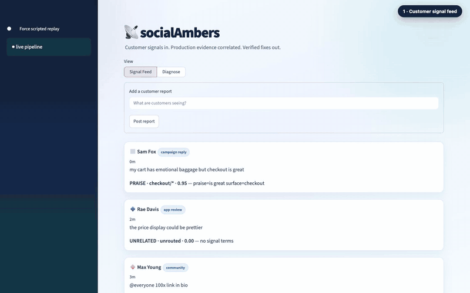

# SocialAmbers

SocialAmbers detects clusters of customer complaints as early signals of production issues. Once enough independent voices identify a pattern, it corroborates the claim against telemetry, deployment history, structural call graphs, and Greptile review findings. The resulting diagnosis distinguishes the visible crash site from the likely root cause and can hand a verified fix instruction to a deterministic fixture-based coding agent.

The Streamlit dashboard provides two views: **Signal Feed** collects normalized customer evidence, while **Diagnose** shows clustering, the evidence pipeline, Greptile provenance, root-cause findings, and the fix workflow.

## Demo

[](artifacts/socialambers-demo.mp4)

▶️ **Select the preview to open the full-quality MP4, or [download the demo video](artifacts/socialambers-demo.mp4).**

## Reference application and fixture disclaimer

Diagnoses and local fix replays run against [weicc21/acme-shop](https://github.com/weicc21/acme-shop), a deliberately instrumented reference application.

> **Fixture disclaimer:** ACME Shop was prepared as a demo fixture before the hackathon. It does not contribute to the implementation of SocialAmbers and is not part of this project's solution code. It exists only as a stable target repository containing known scenarios, telemetry fixtures, deployment metadata, and code locations against which SocialAmbers can demonstrate diagnosis and verified fix replay.

## Prerequisites

- Python 3.11 or newer
- Git
- Node.js and npm, used when verifying ACME Shop fix fixtures
- An optional Greptile API key for live review lookup

Clone both repositories and install the Python dependencies:

```bash
git clone https://github.com/weicc21/acme-shop.git
git clone <socialambers-repository-url> socialAmbers
cd socialAmbers

python3 -m venv .venv
source .venv/bin/activate
pip install -r requirements.txt
```

Create `.env` in the SocialAmbers root. Values should be unquoted:

```dotenv
ACME_SHOP_PATH=/absolute/path/to/acme-shop
GREPTILE_API_KEY=your-key-if-using-live-review
```

`GREPTILE_API_KEY` is optional. Without it, the diagnosis pipeline reports cached review provenance explicitly rather than presenting fixture evidence as a live Greptile response.

## Run the complete application

The process manager starts the Flask backend, manual ingestion watcher, and Streamlit frontend, then seeds the deterministic complaint feed:

```bash
./run.sh restart
./run.sh status
```

Open [http://localhost:8501](http://localhost:8501).

In the dashboard:

1. Open **Signal Feed** to inspect or submit customer reports.
2. Open **Diagnose** to see the independent-voice clusters.
3. Select **Diagnose now** to process queued reports and stream evidence events at 0.3-second intervals.
4. Inspect telemetry, deployment, callgraph, and Greptile evidence in the completed diagnosis.
5. Select a completed issue and choose **Fix issue** to replay its captured, locally verified patch on an isolated `fix/socialclues/*` branch.

Fix replay changes only the local ACME Shop checkout. It does not push commits or open a pull request. Multiple fixes are serialized and each begins from the clean pinned base so patches cannot leak between fix branches.

Stop all services when finished:

```bash
./run.sh stop
```

## Useful commands

```bash
./run.sh start                     # start backend, ingestion, and UI
./run.sh restart ui                # restart only Streamlit; preserve runtime state
./run.sh post "promo code 500s"    # submit a complaint through the backend
./run.sh run                       # trigger the manual diagnosis pipeline
./run.sh logs ingest               # inspect ingestion and engine events
./run.sh fix sig-0001              # replay a captured verified fix
./run.sh reset-shop                # restore the reference app between demos
./run.sh test                      # run static and compilation checks
./run.sh clean                     # stop services and clear runtime state
```

Running `./run.sh restart` performs a full demo reset: it stops services, safely restores actor-owned ACME Shop fix branches, clears generated runtime state, starts all components, and seeds the complaint feed. Restarting a single component does not clear the active investigation.

## Run components separately

Use separate terminals from the repository root:

```bash
# Flask API
./.venv/bin/python -m flask --app backend.app run --host 127.0.0.1 --port 5000

# Manual ingestion watcher
./.venv/bin/python ingest.py --watch --manual --threshold 3 --pace 0.25 --engine-pace 0.3

# Streamlit dashboard
./.venv/bin/streamlit run frontend/app.py --server.port 8501 --server.headless true
```

The frontend uses `http://127.0.0.1:5000` by default. Set `API_URL` to use another backend address. When the backend is unavailable, the frontend clearly switches to its offline **scripted replay** instead of silently presenting fixture data as live output.

## Runtime architecture

- `frontend/` — Streamlit presentation and offline replay data
- `backend/` — Flask transport, complaint classification, and signal APIs
- `engine/` — deterministic telemetry, deployment, callgraph, review, correlation, and fix-instruction logic
- `ingest.py` — complaint bus watcher and investigation dispatcher
- `agent.py` — hash-bound fixture replay actor; it never calls a model or silently falls back
- `runtime/` — generated JSON/JSONL state, event logs, diagnoses, instructions, process metadata, and actor status

All live dashboard data crosses the Flask API and remains inspectable under `runtime/`.
